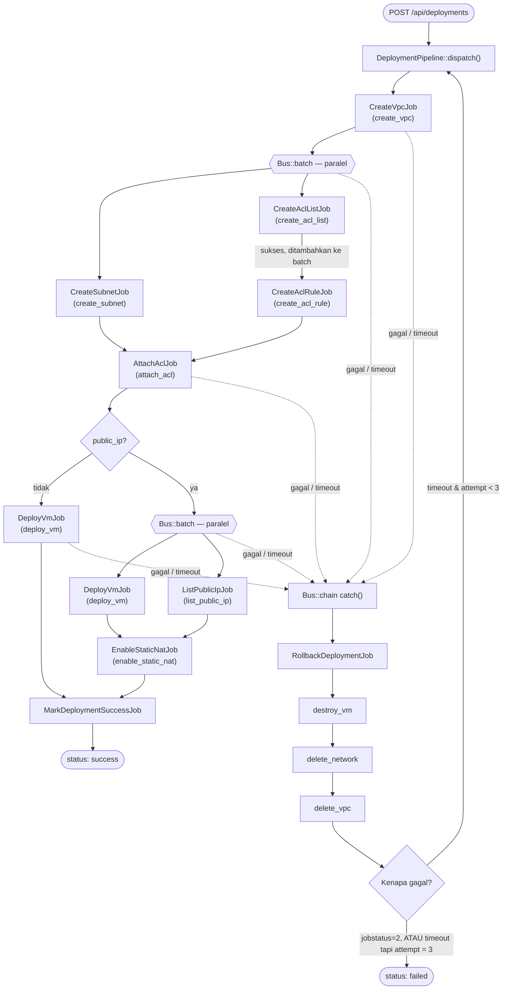
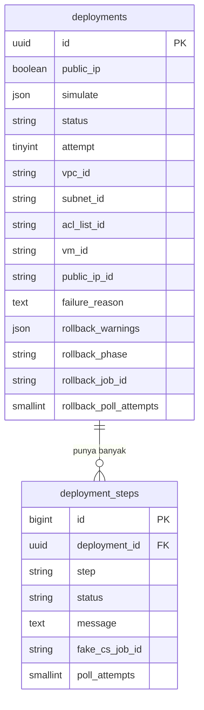

# WowDev Contest — VM Deployment Orchestrator

Service yang mensimulasikan proses "deploy VM ke cloud" (create VPC → subnet →
ACL → deploy VM → allocate public IP) dengan memanggil mock API **fake-cs**,
lengkap dengan penanganan proses paralel, retry, dan rollback otomatis kalau
ada langkah yang gagal atau timeout. Detail requirement ada di [requirement.md](requirement.md).

## Versi

| | Versi |
|---|---|
| PHP | `^8.3` (dikembangkan & dites di PHP 8.4.14) |
| Laravel | 13 (`laravel/framework: ^13.8`, terpasang 13.24.0) |
| Database | MySQL |
| Queue driver | `database` (bawaan Laravel, tanpa Redis/Horizon) |

Tidak ada library pihak ketiga di luar bawaan Laravel (`laravel/framework`,
`laravel/sanctum`, `laravel/tinker`) — semua HTTP call, polling job async, dan
paralelisme dikerjakan pakai `Illuminate\Support\Facades\Http` dan
`Illuminate\Support\Facades\Bus` bawaan framework.

## Setup

Project di-zip **tanpa folder `vendor/`**, jadi perlu `composer install` dulu.

```bash
composer install
cp .env.example .env      # Windows: copy .env.example .env
php artisan key:generate
```

### Database

Pakai **MySQL**, ubah bagian ini di `.env` sebelum migrate:

```env
DB_CONNECTION=mysql
DB_HOST=127.0.0.1
DB_PORT=3306
DB_DATABASE=challenge_new
DB_USERNAME=root
DB_PASSWORD=
```

lalu buat database-nya (`CREATE DATABASE challenge_new;`) dan jalankan
`php artisan migrate`.

### Fake-CS

Base URL API mock sudah di-set default di `.env.example`:

```env
FAKE_CS_BASE_URL=https://fake-cs.virmata.com/api/api
```

### Menjalankan aplikasi

Butuh **dua proses** jalan bersamaan — web server (terima request) dan queue
worker (yang benar-benar mengeksekusi flow deploy-nya):

```bash
php artisan serve                                    # terminal 1
php artisan queue:work --queue=default --sleep=1      # terminal 2
```

> Jalankan **lebih dari satu** `queue:work` sekaligus (mis. 3–4 proses) kalau
> mau melihat efek paralelisme antar-deployment yang berbeda secara nyata —
> dengan 1 worker saja, semuanya tetap benar (paralel di dalam 1 deployment
> tetap jalan lewat `Bus::batch`), cuma antar-deployment jadi gantian.

Cek `php artisan route:list --path=deployments` untuk memastikan endpoint
sudah terdaftar.

## Arsitektur & Alur

Pattern yang dipakai: **Saga (orchestration-based)** — setiap langkah (`create
VPC`, `deploy VM`, dst) adalah 1 Job Laravel kecil (`app/Jobs/Steps/*`),
disusun jadi satu alur oleh `App\Services\Deployment\DeploymentPipeline`
memakai `Bus::chain()` (berurutan) dan `Bus::batch()` (paralel) — bentuknya
persis mengikuti dependency antar-step: dua step baru paralel kalau
sama-sama cuma butuh output dari step yang sama sebelumnya.

Job async (yang di command matrix fake-cs tandanya `Async = YES`, cuma
membari response `jobid`) tidak pernah `sleep()` menunggu — mereka `release()` diri
sendiri kembali ke antrian dan dicek lagi beberapa detik kemudian
(`App\Jobs\Steps\PollsFakeCsJob`), supaya worker bebas mengerjakan deployment
lain sambil menunggu.

Kalau ada step yang gagal (`jobstatus = 2`) atau timeout (curl tidak dapat
respons), `App\Jobs\RollbackDeploymentJob` jalan: hapus resource yang sudah
sempat terbentuk (urutan wajib: VM dulu → subnet → VPC, karena fake-cs
menolak hapus subnet yang masih ada VM aktif di dalamnya), lalu:
- kalau penyebabnya **gagal** (`jobstatus=2`) → berhenti, status jadi `failed`.
- kalau penyebabnya **timeout** → seluruh flow diulang dari awal (maksimal 3x
  percobaan), baru `failed` kalau tetap gagal di percobaan ke-3.



### Struktur kode

| Lapisan | File |
|---|---|
| HTTP | `app/Http/Controllers/DeploymentController.php`, `app/Http/Requests/StoreDeploymentRequest.php` |
| Orkestrator | `app/Services/Deployment/DeploymentPipeline.php` |
| Step jobs | `app/Jobs/Steps/*.php` (base: `PollsFakeCsJob` untuk async, `SyncStepJob` untuk sync) |
| Rollback | `app/Jobs/RollbackDeploymentJob.php` |
| Client fake-cs | `app/Services/FakeCs/FakeCsClient.php` (`trigger()` + `checkJob()`, tanpa loop/blocking) |
| Model & state | `app/Models/Deployment.php`, `app/Models/DeploymentStep.php` |
| Simulasi test | `app/Support/SimulateOptions.php`, `app/Enums/FlowStep.php` |

### Desain Database

Cuma 2 tabel



**`deployments`** — 1 baris = 1 deployment (= 1 "user" request):

| Kolom | Kegunaan |
|---|---|
| `id` | UUID, sekaligus identitas "user" — tidak ada tabel `users` terpisah |
| `public_ip` | Apakah perlu alokasi public IP (Static NAT) |
| `simulate` | Payload `{step, result, delay, timeout}` opsional untuk demo skenario |
| `status` | `pending` → `processing` → (`rolling_back` → `retrying` →) `success`/`failed` |
| `attempt` | Percobaan ke berapa, maks `DeploymentPipeline::MAX_ATTEMPTS` (3) |
| `vpc_id`, `subnet_id`, `acl_list_id`, `vm_id`, `public_ip_id` | Resource id yang sudah berhasil dibuat — sumber kebenaran tunggal untuk progress DAN untuk `RollbackDeploymentJob` tahu apa yang perlu dihapus |
| `failure_reason` | Pesan error final kalau `status=failed` |
| `rollback_warnings` | Riwayat langkah rollback yang gagal/timeout tapi tetap dilewati (lihat bagian `GET` di bawah) |
| `rollback_phase`, `rollback_job_id`, `rollback_poll_attempts` | State polling milik `RollbackDeploymentJob` — harus di database, bukan properti Job, karena `release()` Laravel tidak menyimpan ulang mutasi objek job (cuma re-queue payload asli) |

**`deployment_steps`** — 1 baris per step per deployment (`unique(deployment_id, step)`), diperbarui di tempat lewat `updateOrCreate()`/`firstOrCreate()` — bukan ditambah terus:

| Kolom | Kegunaan |
|---|---|
| `deployment_id` | FK ke `deployments.id`, `cascadeOnDelete()` |
| `step` | Salah satu nilai `App\Enums\FlowStep`, mis. `create_vpc` |
| `status` | `pending`/`processing`/`success`/`failed` — ini yang dibaca `GET /api/deployments/{id}` buat progress per step |
| `message` | Pesan error kalau step ini yang gagal |
| `fake_cs_job_id`, `poll_attempts` | State polling milik `PollsFakeCsJob` — alasan sama seperti `rollback_*` di atas: harus persist di DB karena job bisa `release()` berkali-kali sebelum selesai |

## Dokumentasi Endpoint

### `POST /api/deployments`

Membuat deployment baru — setiap request dianggap user baru (tidak ada login
atau validasi duplikat). Direspons langsung `202 Accepted` sebelum flow-nya
selesai; progress dicek lewat endpoint `GET` di bawah.

**Body:**

```json
{
  "public_ip": true,
  "simulate": {
    "step": "attach_acl",
    "result": 2,
    "delay": 5,
    "timeout": 35
  }
}
```

| Field | Wajib | Keterangan |
|---|---|---|
| `public_ip` | ya | `true`/`false` — apakah VM perlu dialokasikan public IP (Static NAT) |
| `simulate` | tidak | Blok opsional untuk memaksa 1 step tertentu gagal/lambat/timeout, buat demo |
| `simulate.step` | wajib kalau `simulate` dikirim | Salah satu: `create_vpc`, `create_subnet`, `create_acl_list`, `create_acl_rule`, `attach_acl`, `deploy_vm`, `list_public_ip`, `enable_static_nat` |
| `simulate.result` | tidak | `1` (paksa sukses) atau `2` (paksa `jobstatus=2` → demo "Failed Job") |
| `simulate.delay` | tidak | Detik — job tetap `jobstatus=0` selama ini sebelum selesai |
| `simulate.timeout` | tidak | Detik — fake-cs sengaja tidak merespons selama ini (demo "Timeout"); pakai nilai > 30 supaya curl beneran timeout |

**Response `202 Accepted`:**

```json
{
  "deployment_id": "019fea...",
  "status": "pending",
  "status_url": "http://127.0.0.1:8000/api/deployments/019fea..."
}
```

### `GET /api/deployments/{id}`

Progress & hasil akhir deployment.

```json
{
  "deployment_id": "019fea...",
  "public_ip": true,
  "status": "processing",
  "attempt": 1,
  "resources": {
    "vpc_id": "...",
    "subnet_id": "...",
    "acl_list_id": "...",
    "vm_id": null,
    "public_ip_id": null
  },
  "failure_reason": null,
  "rollback_warnings": [],
  "steps": [
    { "step": "create_vpc", "status": "success", "message": null, "updated_at": "..." },
    { "step": "create_subnet", "status": "processing", "message": null, "updated_at": "..." }
  ]
}
```

`rollback_warnings` — rollback bersifat *best-effort*: kalau salah satu langkah
hapus (`destroyVirtualMachine`/`deleteNetwork`/`deleteVpc`) gagal atau
timeout, itu dicatat di sini dan cleanup tetap lanjut ke resource berikutnya
(bukan berhenti) — supaya proses tidak pernah macet. Artinya `resources.*_id`
yang sudah `null` **tidak selalu berarti resource itu benar-benar terhapus di
fake-cs** — cek array ini untuk tahu langkah mana yang gagal dibersihkan:

```json
"rollback_warnings": [
  {
    "attempt": 1,
    "command": "deleteNetwork",
    "reason": "deleteNetwork failed: Entity network with id = ... does not exist.",
    "at": "2026-08-11T15:14:12+00:00"
  }
]
```

`status` deployment: `pending` → `processing` → (`rolling_back` →
`retrying` → `processing` lagi, kalau timeout) → `success` atau `failed`.

`steps[].status`: `pending`, `processing`, `success`, `failed`.

### Contoh skenario

**1. Sukses, tanpa public IP:**
```bash
curl -X POST http://127.0.0.1:8000/api/deployments \
  -H "Content-Type: application/json" \
  -d '{"public_ip": false}'
```

**2. Sukses, dengan public IP:**
```bash
curl -X POST http://127.0.0.1:8000/api/deployments \
  -H "Content-Type: application/json" \
  -d '{"public_ip": true}'
```

**3. Demo Failed Job** (paksa `jobstatus=2` di `create_acl_rule`):
```bash
curl -X POST http://127.0.0.1:8000/api/deployments \
  -H "Content-Type: application/json" \
  -d '{"public_ip": true, "simulate": {"step": "create_acl_rule", "result": 2}}'
```

**4. Demo Timeout** (retry otomatis sampai 3x sebelum menyerah):
```bash
curl -X POST http://127.0.0.1:8000/api/deployments \
  -H "Content-Type: application/json" \
  -d '{"public_ip": false, "simulate": {"step": "attach_acl", "timeout": 35}}'
```

Lalu cek hasilnya:
```bash
curl http://127.0.0.1:8000/api/deployments/{deployment_id}
```
